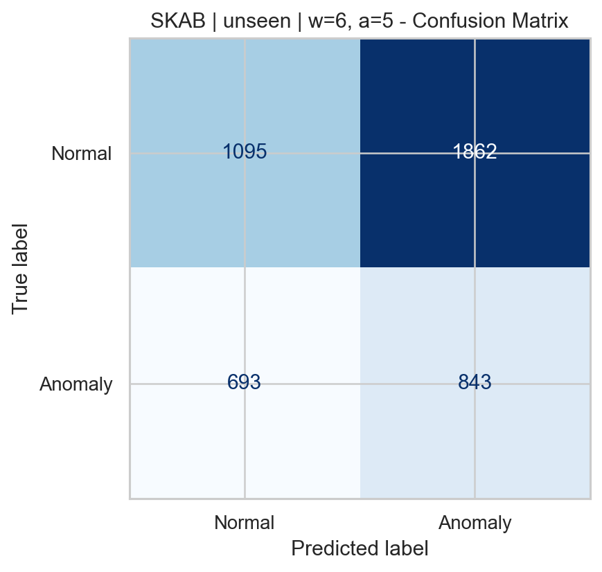
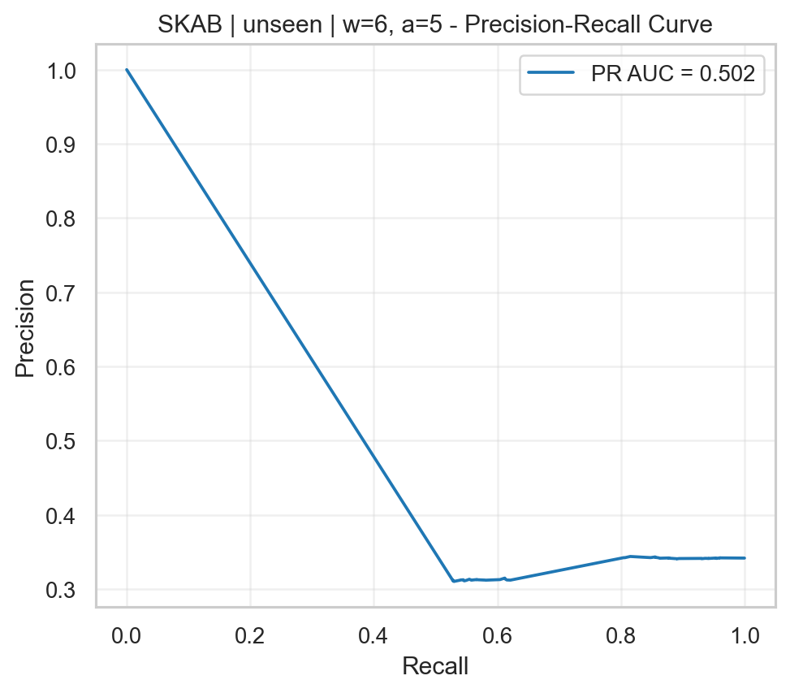
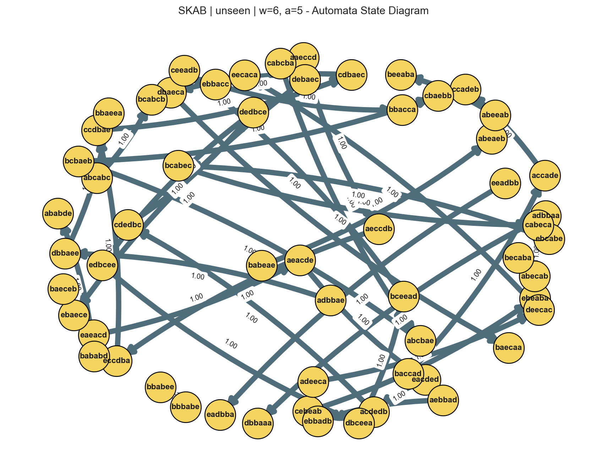
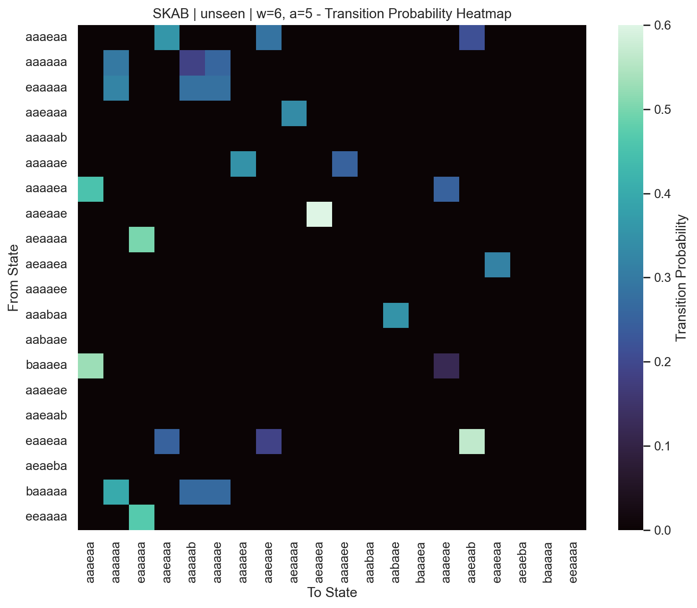
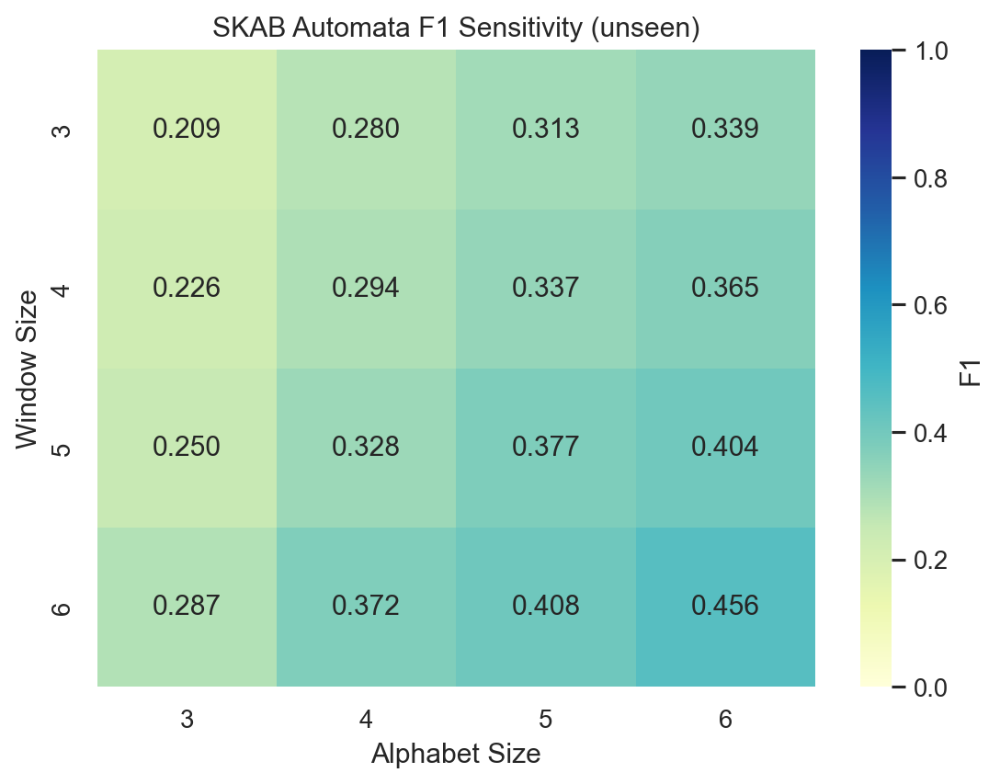

# BlackBox-vs-Automata-TS

## XI. Reporting and Expectations

The goal of this report is not to choose a single "best" model, but to analyze in a systematic way how black-box deep learning models and interpretable probabilistic automata behave under different data conditions.

Datasets used:

- `SKAB`
- `BATADAL`

Compared model families:

- `Automata`
- `LSTM`
- `GRU`
- `CNN1D`

Evaluated scenarios:

- `original`
- `gaussian_noise`
- `unseen`

This README is based on the following final report artifacts:

- [SKAB benchmark](results/skab/stage2_w6_a5_benchmark_report.md)
- [BATADAL benchmark](results/batadal/stage2_w6_a5_benchmark_report.md)
- [SKAB parameter analysis](results/skab/parameter_analysis_report.md)
- [BATADAL parameter analysis](results/batadal/parameter_analysis_report.md)

## Experimental Setup

In the final comparison report, the automata configuration was selected as `window_size=6` and `alphabet_size=5`.

- `SKAB`: results are reported as averages across 5 folds.
- `BATADAL`: results are reported on a single time-ordered test split.

This difference matters: `SKAB` results include variance across folds, while `BATADAL` results mainly reflect behavior on one fixed split.

## 1. Model Comparisons

### SKAB

On `SKAB`, looking only at accuracy is misleading. `GRU` achieved the highest accuracy in all three scenarios, but since `precision=0`, `recall=0`, and `f1=0`, it effectively behaves like a majority-class predictor that fails to detect anomalies.

| Scenario | Best Accuracy | Best F1 | Comment |
|---|---:|---:|---|
| Original | GRU `0.6492` | LSTM `0.3892` | The accuracy leader and the real detection leader are different. |
| Gaussian Noise | GRU `0.6451` | LSTM `0.3823` | LSTM is the most balanced model under noise. |
| Unseen | GRU `0.6492` | Automata `0.4078` | Automata achieves the best F1 on unseen examples. |

Main observations for SKAB:

- `LSTM` is the most balanced overall model under original and noisy conditions.
- `CNN1D` can produce high recall, but it shows strong instability across folds.
- `Automata` is weaker than LSTM in the original scenario, but it achieves the best F1 and recall in the unseen scenario.
- `GRU` is not functionally useful as an anomaly detector beyond its accuracy score.

### BATADAL

On `BATADAL`, deep learning models, especially `GRU`, appear clearly stronger.

| Scenario | Best Accuracy | Best F1 | Comment |
|---|---:|---:|---|
| Original | GRU `0.9590` | GRU `0.3265` | GRU is the dominant model. |
| Gaussian Noise | GRU `0.9590` | GRU `0.3265` | It is almost unaffected by noise. |
| Unseen | GRU `0.8918` | CNN1D `0.1493` | All models degrade under unseen conditions. |

Main observations for BATADAL:

- `GRU` leads in both accuracy and F1 for the original and noisy scenarios.
- `LSTM` gives the highest recall, but its precision is very low.
- `Automata`, despite being interpretable, is not competitive on BATADAL in terms of F1.
- `CNN1D` is the F1 leader in the unseen scenario, but the absolute performance level remains low.

## 2. Performance Differences Across Datasets

The two datasets reward model families in very different ways.

- `BATADAL` seems more favorable for deep learning models. In particular, `GRU`, despite its poor behavior on `SKAB`, achieves very high accuracy and the best F1 here.
- `SKAB` gives more room to the automata approach when unseen symbolic patterns are involved. The `Automata` model achieves the best result in the `SKAB unseen` scenario with `F1=0.4078`.
- On `BATADAL`, the automata model sometimes improves recall, but its precision remains too low for F1 to become competitive.
- On `SKAB`, fold-level variance is clearly visible, which suggests a more heterogeneous dataset and more sensitive model behavior.

In summary:

- `BATADAL`: favors deep learning
- `SKAB unseen`: favors automata
- `SKAB original/noise`: favors LSTM

## 3. Noise Impact Analysis

### SKAB

On `SKAB`, the effect of noise varies by model.

- `LSTM` changes only slightly, from original `F1=0.3892` to noisy `0.3823`.
- `CNN1D` drops to `F1=0.2666`, showing a more fragile profile.
- `Automata` improves in accuracy under noise (`0.4512 -> 0.5738`), but its `F1=0.3409 -> 0.2954` decreases. This suggests that the model becomes more conservative and loses recall.
- `GRU` is already weak, so it does not show a meaningful recovery under noise.

### BATADAL

On `BATADAL`, the effect of noise is much more limited.

- `GRU` remains almost identical in the original and noisy scenarios.
- `LSTM` and `CNN1D` also show only small changes.
- On the automata side, recall increases, but precision remains too low for overall quality to improve much.

As a result, in terms of noise robustness:

- Most stable model on `BATADAL`: `GRU`
- Most stable model on `SKAB`: `LSTM`

## 4. Unseen Data Behavior

The unseen scenario is one of the most important parts of this project, because it directly tests the Levenshtein-based unseen mapping behavior of the automata approach.

### SKAB

`SKAB unseen` produces a strong result for automata:

- `Automata recall = 0.5585`
- `Automata F1 = 0.4078`

These values show that the `Automata` model improves in recall and F1 compared to the original scenario. Even though accuracy drops, the model becomes better at capturing unseen patterns. This is the strongest empirical sign that the unseen-handler design is working.

### BATADAL

The picture is different for `BATADAL unseen`:

- `Automata recall = 0.5833`
- but `precision = 0.0548`, so `F1 = 0.1002`

In other words, the automata model flags unseen examples more often, but a large portion of those flags are false positives. This suggests that interpretability is preserved, but the decision boundary does not adapt well enough to this dataset.

## 5. Parameter Effects

### Parameter sensitivity on SKAB

On `SKAB`, the automata model is highly sensitive to parameter choices.

- Small windows and small alphabets (`w=3, a=3`) produce high accuracy but very low recall and F1.
- As window size and alphabet size increase, the model becomes more aggressive, recall increases, and accuracy decreases.
- The strongest automata F1 results appear under larger parameter settings.

Notable examples:

- Highest automata F1 in the original scenario: `w=6, a=6 -> 0.4329`
- Highest automata F1 in the Gaussian noise scenario: `w=6, a=6 -> 0.3780`
- Highest automata F1 in the unseen scenario: `w=6, a=6 -> 0.4560`

This reveals an important trade-off:

- small parameters: higher accuracy, lower anomaly sensitivity
- large parameters: lower accuracy, higher recall, stronger unseen detection

The selected `w=6, a=5` setting can therefore be seen as a middle ground, but in terms of pure automata F1, `w=6, a=6` looks stronger.

### Parameter sensitivity on BATADAL

On `BATADAL`, changing automata parameters does affect behavior, but the absolute performance level remains limited.

- Larger window and alphabet combinations increase recall.
- However, precision remains very low, so F1 gains are limited.
- Across the grid, automata F1 mostly stays in the `0.08 - 0.13` range.

This means:

- Parameter tuning does not make the automata model fully competitive on `BATADAL`.
- Here, parameter tuning changes decision behavior more than it improves final quality.

## 6. Scientific Interpretation

The most important scientific conclusions of this project are:

- Model behavior depends strongly on the dataset; no single model is best everywhere.
- `Accuracy` alone is not a reliable metric, especially in imbalanced anomaly detection problems.
- The `SKAB unseen` scenario highlights the strongest use case of the automata approach.
- On `BATADAL`, deep learning models are clearly more advantageous.
- Increasing automata parameters improves recall and unseen sensitivity, but this comes at an accuracy cost.

## 7. Required Figures

The figures below were selected as the minimum required visual set for the report. For consistency, the same representative experiment setting is used: `SKAB`, `unseen`, `window_size=6`, `alphabet_size=5`, `fold=1`.

### Confusion Matrix

### Precision-Recall Curve

### Automata State Diagram

### Transition Probability Heatmap

### Parameter Sensitivity Plot

The figure below shows how the automata model's `F1` in the `unseen` scenario changes with window size and alphabet size.

## 8. Conclusion

This study shows that there is no single universal winner; instead, model behavior changes depending on context.

- `SKAB original/noisy`: the most balanced model is `LSTM`
- `SKAB unseen`: the most interesting and strongest behavior comes from `Automata`
- `BATADAL`: the strongest overall model is `GRU`
- `Automata`: valuable for interpretability and unseen behavior, but sensitive to the dataset

Therefore, the main output of the project is not a ranking, but this insight: interpretable symbolic models and black-box deep learning models offer different advantages under different data conditions, and meaningful comparison requires scenario-based, metric-based, and parameter-based analysis.
